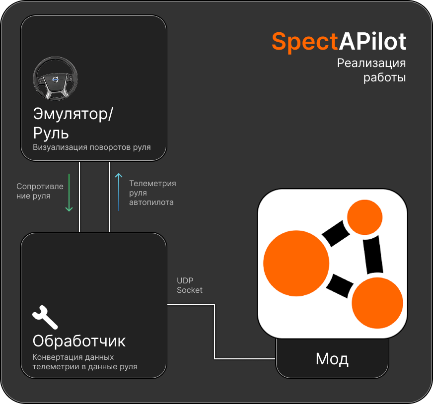
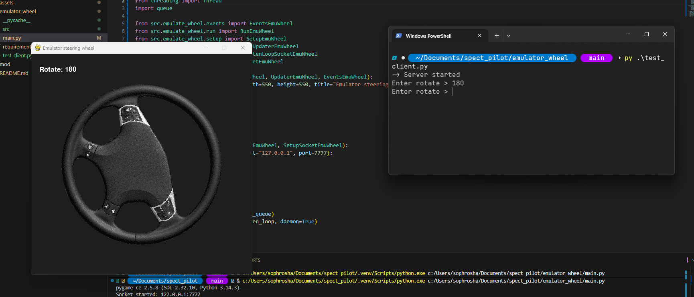

# 
 SpectAPilot (Spectator AutoPilot)

[RU](README.md) | [EN](README_en.md) 

## What is it
A project that implements transfer of steering telemetry to a real physical steering wheel with FFB support from BeamNG.

The goal is to implement an autopilot experience without leaving home, having only a steering wheel with DD/FFB support.
## Project structure

## What's included in the project
**Currently 2 out of 3 project types are implemented.** A mod for the game that captures steering angle telemetry, connects via socket and, when autopilot is enabled, transmits them to a ready-made steering wheel emulator.
### Difficulties
Since the project is created to implement steering movement, a physical device is required for testing. But due to its absence, there is a steering wheel emulator.

If you have a MOZA R5 at home or you are from Perm, or you can help, contact me, we'll discuss and test together. I'd be glad for help!
## Done
### Emulator
To verify the operation of steering wheel rotations and accurate telemetry transmission, an expensive Direct Drive steering wheel is required, which I don't have, as well as money to rent it.
#### Features
- Written in 3 hours 30 minutes;
- Stack: Python, Pygame-CE;
- Steering rotations via H L binds;
- Presence of a receiving socket on port 7777.
#### Goals
- To improve the return of the steering wheel to its original position when no packets are transmitted, to configure IP and socket port via input in the emulator menu.
#### Demonstration

### Mod
The goal of this mod is to transmit steering degree telemetry to an open socket of the emulator/processor.
#### Goals
- Implement a connection settings menu for the mod;
- Additional telemetry transmission rate parameters;
- Enable via key bind.
#### Demonstration
Coming soon
## Will be developed soon
### Processor
Transmission of raw telemetry data from the game to the steering wheel with interpolation and other value processing for smooth steering rotation.
#### Features
- Stack: Python, pvjoy/vgamepad
- Full processor configuration into the steering wheel data
- Initial support for MOZA steering wheel
#### Goals
- Basic processor operation
- Interpolation settings, movement force
- Transmitting data on steering rotations and generating data on force and rotation for a specific number of degrees